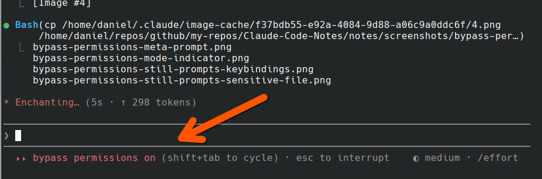
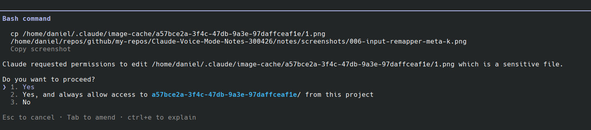
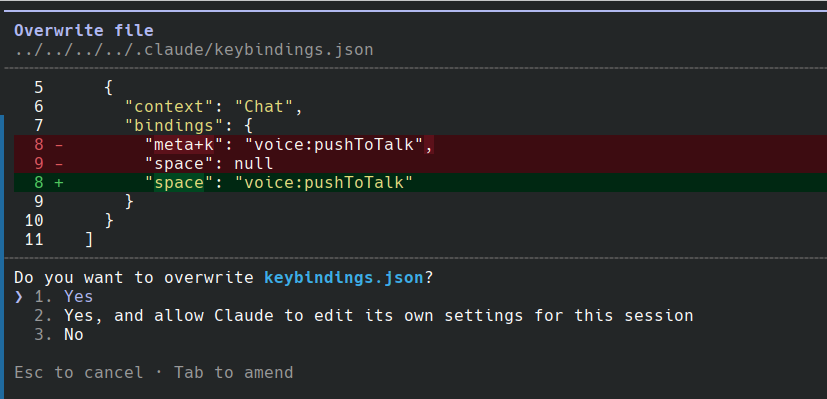
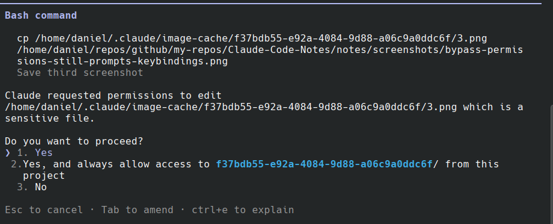

# Bypass Permissions As The Default Mode (User Level)
30/04/2026

If you're tired of approving every Bash command, file write, and tool call — and you've decided you trust Claude enough to just let it run — you can flip the default permission mode at the user level so every new Claude Code session boots straight into bypass mode.

This is the persistent equivalent of launching with `--dangerously-skip-permissions`. Instead of remembering the flag (or aliasing it), you set it once in your user settings and forget about it.

## How

Edit `~/.claude/settings.json` and add:

```json
{
  "permissions": {
    "defaultMode": "bypassPermissions"
  }
}
```

That's it. New sessions start in bypass mode. No flag needed.

The other accepted values for `defaultMode` are `default`, `acceptEdits`, and `plan` — but if you're reading this note, `bypassPermissions` is what you want.

## Why user-level

`~/.claude/settings.json` applies to every project. If you only want this for one repo, set it in `.claude/settings.json` (project-shared, committed) or `.claude/settings.local.json` (project-local, gitignored) instead. User-level is the right place when this is your default posture across the board.

## Disclaimers

This is **dangerously skip permissions** — that's literally the flag's name. It means:

- Claude can run any Bash command without asking
- It can write/delete files freely
- MCP tools fire without confirmation
- Destructive operations (`rm -rf`, `git reset --hard`, force pushes) won't get a prompt

If you wouldn't hand a junior engineer your shell with sudo, don't enable this. I do enable it because I run Claude in environments I'm comfortable losing, and because the friction of approving every action breaks the flow that makes Claude Code useful for me. Your tolerance may differ.

A reasonable middle ground is `acceptEdits` — auto-accepts file edits but still prompts for Bash and MCP. Worth considering if full bypass feels like too much.

## Bypass isn't total — sensitive paths still prompt

Worth noting: even with bypass mode on, Claude Code still intercepts operations against paths it considers sensitive and asks for confirmation. I hit this several times on 30/04/2026 — bypass mode was clearly active (the bottom of the TUI shows `bypass permissions on`):



…but a `cp` out of `~/.claude/image-cache/` still got an approval prompt:



…and editing `~/.claude/keybindings.json` triggered an "Overwrite file" confirmation with a special "allow Claude to edit its own settings for this session" option:



…and even copying *the screenshot of the previous prompt* — also out of `~/.claude/image-cache/` — got intercepted:



So bypass = "skip the routine confirmations", not "skip every confirmation". Anything inside `~/.claude/` — image cache, keybindings, presumably other settings and state files — still gets a guardrail, and edits to Claude's own config get a separate per-session allow option rather than being auto-approved by bypass mode. That's probably the right call (you don't want a runaway session rewriting its own keybindings silently), but don't be surprised by it.

## Caveat

Claude Code moves fast. The setting key, accepted values, or behaviour could change. If `bypassPermissions` stops working, check `claude config` or the current docs for the canonical name.
